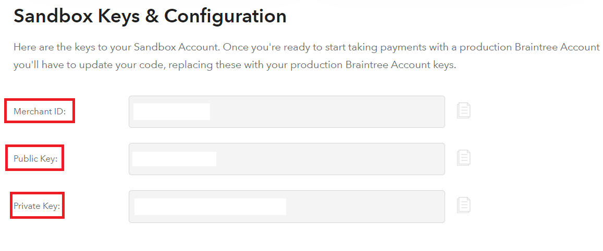
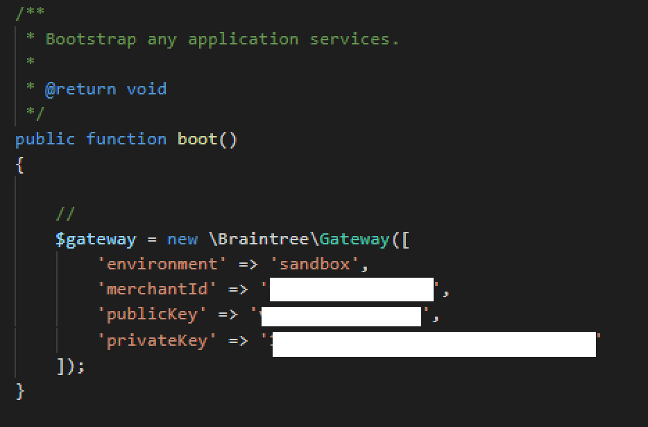
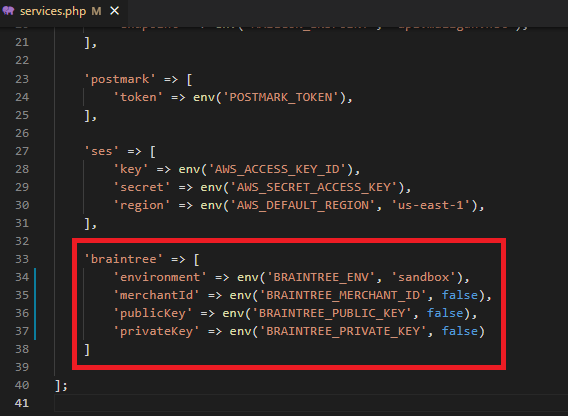

# Installare Braintree con Laravel

## Installare il pacchetto di Braintree attraverso Composer

        composer require braintree/braintree_php

## Aggiungere le seguenti righe al file .env

        BRAINTREE_ENV=sandbox
        BRAINTREE_MERCHANT_ID=
        BRAINTREE_PUBLIC_KEY=
        BRAINTREE_PRIVATE_KEY=

## Registrarsi al sito Braintree Test Sandbox

[link](https://www.braintreepayments.com/it/sandbox?referrer=https%3A%2F%2Fmedium.com%2Fzestgeek%2Fbraintree-integration-with-laravel-cd9d155f1184)

- Collegarsi poi al [pannello di controllo](https://sandbox.braintreegateway.com/) dove troverete le keys per la configurazione

- Inserire nel file **.env** le keys

## Settiamo Braintree in Laravel

- All'interno del file **App/Providers/AppServiceProvider.php** aggiungiamo nella funzione **boot** sempre i dati di braintree:

        $gateway = new \Braintree\Gateway([
                    'environment' => 'sandbox',
                    'merchantId' => 'enter_code_merchantId',
                    'publicKey' => 'enter_public_key',
                    'privateKey' => 'enter_private_key'
                ]);

## Aggiorniamo il file services.php

- Apriamo il file **config/service.php**

- Aggiungiamo il controllo *braintree*

        'braintree' => [
                'environment' => env('BRAINTREE_ENV', 'sandbox'),
                'merchantId' => env('BRAINTREE_MERCHANT_ID', false),
                'publicKey' => env('BRAINTREE_PUBLIC_KEY', false),
                'privateKey' => env('BRAINTREE_PRIVATE_KEY', false)
            ]

## Creiamo il controller dedicato

        php artisan make:controller GuestController

- Aggiungiamo i seguenti **use**        
        
        use Braintree\Gateway;

- Aggiungiamo la funzione **cart**

        public function cart()
            {

                $gateway = new Gateway([
                    'environment' => config('services.braintree.environment'),
                    'merchantId' => config('services.braintree.merchantId'),
                    'publicKey' => config('services.braintree.publicKey'),
                    'privateKey' => config('services.braintree.privateKey')
                ]);
                
                $token = $gateway->clientToken()->generate();

                return view('cart', compact('token'));   
                
            }

## Creiamo la route in web.php

        Route::get('/cart', 'GuestController@cart')->name('cart');

## Creiamo la views

- la chiamiamo nel nostro esempio **cart.blade.php**
- aggiungiamo lo script in *head*

        

- Testa con *php artisan serve* che la pagina si veda correttamente; se i dati non sono coerenti con quelli del sito braintree la pagina darà errore di collegamento

## Crea lo script e il form di pagamento

- Nel nostro esempio

        <form id="pay_form" action="{{ route('cart.checkout')}}" method="POST">
            @csrf
            @method('POST')
            <label for="name">Nome</label>
            <input type="text" id="name" name="name">

            <label for="lastname">cognome</label>
            <input type="text" id="lastname" name="lastname">

            <label for="email">email</label>
            <input type="email" id="email" name="email">

            <label for="address">indirizzo</label>
            <input type="text" id="address" name="address">

            <label for="phone">phone</label>
            <input type="text" id="phone" name="phone">
            
            

            <input id="nonce" name="payment_method_nonce" type="hidden" />
            <button type="submit" > Invia </button>              
                
        </form>

- Inviamo il pagamento al server attraverso l'azione nel form: **action="{{ route('cart.checkout')}}"** andando poi nel controller a gestirlo.

## Gestione collegamento server in GuestController

# Varie

## Numeri di carta da poter testare

Vedi [link](https://developer.paypal.com/braintree/docs/reference/general/testing)

