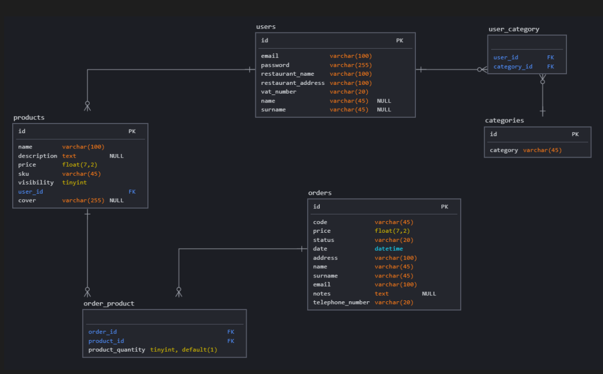

<!-- TOC -->

- [1. Database](#1-database)
  - [1.1. Entities](#11-entities)
  - [1.2. Punti chiave](#12-punti-chiave)
  - [1.3. Schema Relazionale](#13-schema-relazionale)
  - [1.4. Osservazioni](#14-osservazioni)
- [2. Tecnologie Utilizzate](#2-tecnologie-utilizzate)
- [3. Stesura Relazione](#3-stesura-relazione)
  - [3.1. Database](#31-database)

<!-- /TOC -->

# 1. Database

Per la creazione del Database abbiamo per prima cosa individuato le *entities* che rappresentano le nostre tabelle, le abbiamo popolate con le colonne e definito le relazioni tra di esse.

## 1.1. Entities

- **users**: La tabella è composta dai dati personali del ristoratore e dell'attività stessa che in qualità di ristoratore può registrarsi ed accedere all'area di modifica come amministratore. In quest'area ha la possibilità di aggiungere nuovi prodotti al menù e modificarne le caratteristiche.

- **categories**: Il ristoratore deve inserire una o più tipologie per identificare il suo ristorante; questo permetterà all'utente interessato di poterlo ricercare per tipologia.

- **user_category**: tabella ponte per la relazione many-to-many tra i ristoratori e la tipologia di ristorante.

- **products**: La tabella prodotti contiene tutte le caratteristiche relative ad ogni singolo prodotto del menù.

- **orders**: Contiene i dati del cliente e dell'ordine effettuato; inoltre è presente lo stato del pagamento, la data ed eventuali note. 

- **product_order**: tabella ponte per la relazione many-to-many tra prodotti e ordini con l'aggiunta di una terza colonna che rappresenta la quantità di ogni prodotto.

## 1.2. Punti chiave

1. Abbiamo degli ordini
2. Ogni ordine è collegato ad un utente registrato(denominato *ristoratore*) e un utente interessato(denominato *cliente*)
3. Ogni ordine può avere diversi prodotti e il relativo pagamento
4. Ogni ordine ha i dettagli per la spedizione
5. Ogni ristoratore ha la sua tipologia di appartenenza
6. Ogni ristoratore ha più prodotti da proporre ai clienti

## 1.3. Schema Relazionale

## 1.4. Osservazioni

Grazie al sistema di pagamento Braintree non abbiamo bisogno di una tabella per salvare i dati della carta; questo ci permette di rispettare gli standard che definisce la legge.

# 2. Tecnologie Utilizzate

# 3. Stesura Relazione

-  Programma *Vs Studio Code* 
-  Linguaggio *MarkDown*

## 3.1. Database

Per creare lo schema relazionale del DB abbiamo utilizzato il sito [sqldbm](https://app.sqldbm.com/)

